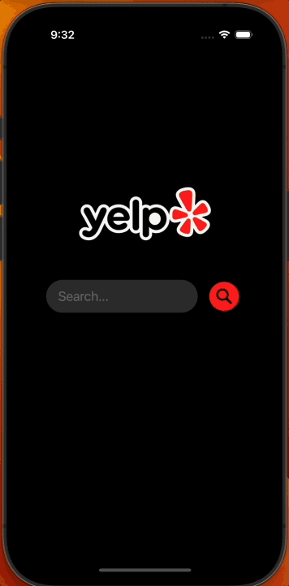

#  BusinessSearch

## Overview
POC app that searches for yelp businesses at a given location

## Technologies

This app was made using UIKit programatically, built on Xcode 14.1.0.
The API used was [Yelp Fusion API](https://docs.developer.yelp.com/docs/fusion-intro), more details on how to get an API key are in the [How to build section](#How-to-build)

## Architecture Organization
The UI design pattern used for this app was MVC, since the UI is not very complex, and does not make huge view controllers.
MVC helps with separating all of the business logic and API requests from the views and controllers. The controllers are in charge of
presenting the views and perfoming navigation across view controllers.

### Classes & Structs

- The `YelpAPIManager` struct is part of the model, as its duty is to perform request to Yelp's API and handles the completion of these requests by parsing
the JSON data into native Swift objects and informing the delegate of its result.
- `APIResponse` is just the decodable structure used to store parsed JSON data. 
- Extensions were created for `UIImage` and `UIImageView` for easier autolayout and asynchronous loading of images.
- ViewControllers will display their corresponding view and provide navigation (if applicable).
- Some views use `UIStackedView`'s because of the layout flexibility that they provide.

## Demo

## How to build

- Clone the project
- Get a Yelp Fusion API authentication key following [these steps.](https://docs.developer.yelp.com/docs/fusion-authentication)
- The API-Info.plist file contains a dictionary key named `API_KEY` with a value of `YOUR_KEY`, replace the value with your
private API key. This is to prevent the API key from being leaked in the public repo.
- Build and run the project 😁 

## Future improvements

- In `YelpAPIManager`, the `parseJSON` function is set up to parse and return and instance of `APIResponse`, 
as there's only one endpoint that the app is calling. If there were to be more endpoints and the need to define multiple
decodable structures, the `parseJSON` function should be refactored to use Generics instead.
- Better error handling: as of now, the app just prints error to the console with the exception of the `APIError.noData` error,
which is presented as the `backgroundView` of the businesses table view.
- Switch to the `URLCache.shared` instance instead of using a global `NSCache` object. For cache persistance.  
- Implement unit tests.
